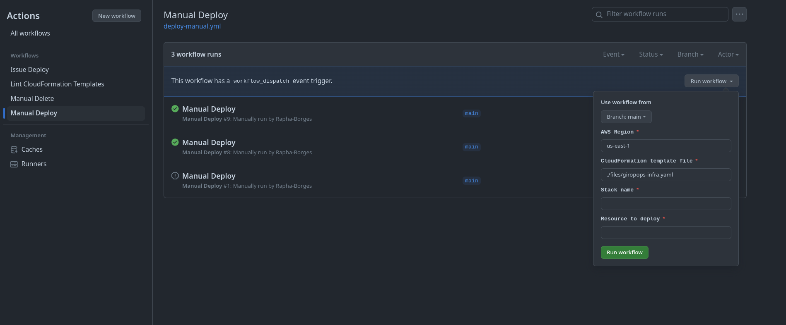
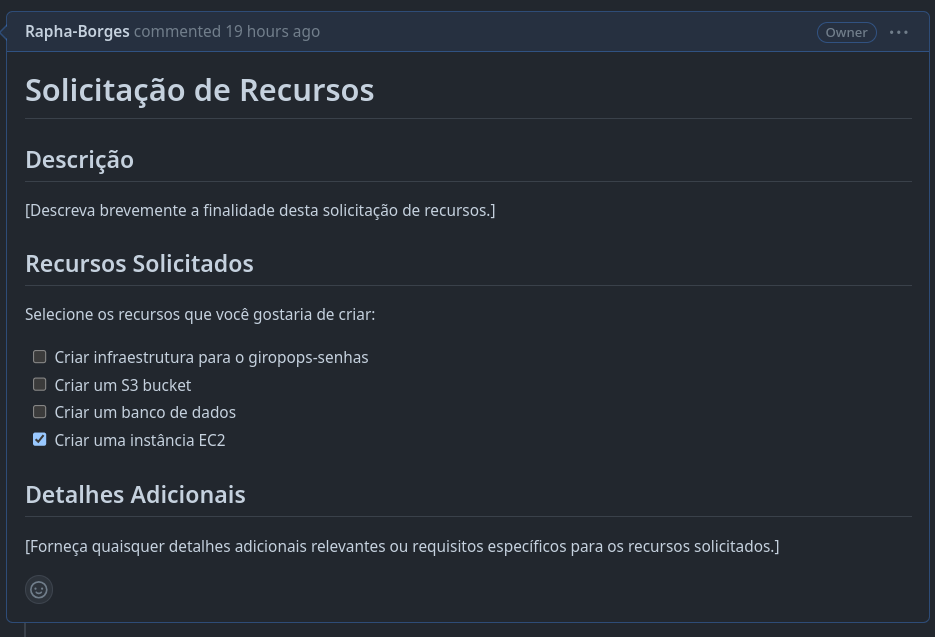
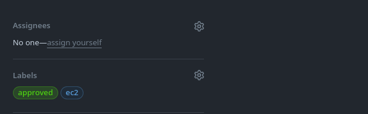
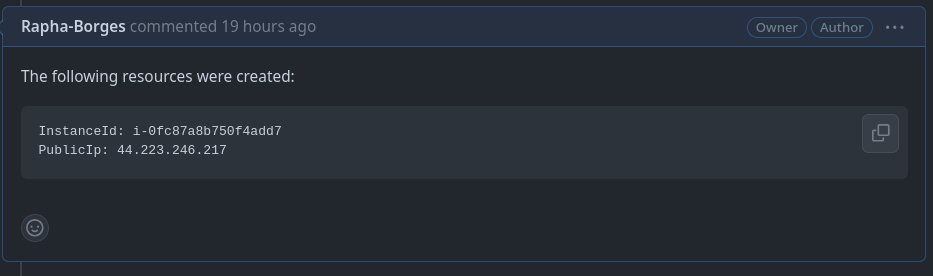
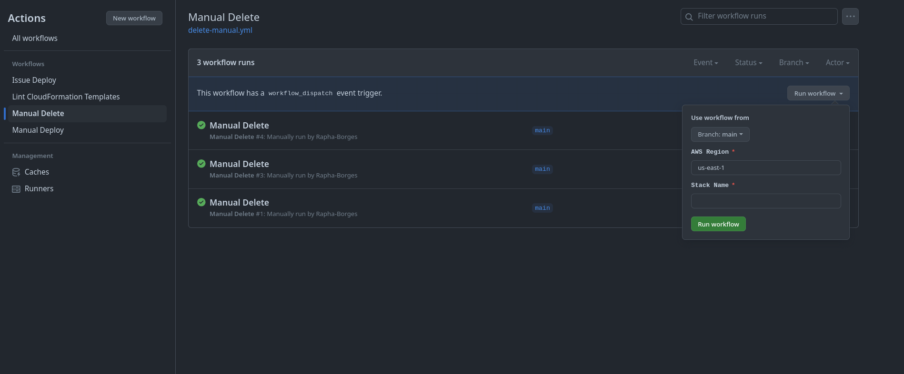

# Studing CloudFormation with GitHub Actions

This repository is a study of how to use GitHub Actions to create and delete a CloudFormation stack.

## Manual Creation

The stack can be created manually using `Manual Deploy` GitHub Actions workflow using the [deploy-manual.yml](./.github/workflows/deploy-manual.yml) file.

- Go to `Actions` tab
- Select `Manual Deploy` workflow
- Click on `Run workflow` button
- Fill the `Parameters` form
    - AWS Region (default: `us-east-1`)
    - CloudFormation Template File (Available at `./files` folder)
    - Stack Name (Ex: `giro`)
    - Resource to deploy (Ex: `VPC`, `EC2`, `RDS`, `S3`, etc)
- Click on `Run workflow` button

## Issue Creation

I also implemented an issue creation workflow that can be triggered by `label` event. This is not a traditional way, but it demonstrates the flexibility of the project. The idea is to create an issue with the resource to be deployed and add the `approved` label to trigger the deployment. The workflow file is available at [deploy-issue.yml](./.github/workflows/deploy-issue.yaml).

Users steps:

- Go to `Issues` tab
- Click on `New issue` button
- Fill the `Title`
- Complete the `Description` according to the template
- Click on `Submit new issue` button

SRE/DevOps steps:

- Validate the issue
- Add a label to the issue (Ex: `ec2`, `rds`, `s3`, etc) that matches the resource to be deployed
- When the resource is autorized, add the `approved` label that will trigger the `issue-creation` workflow

Automated steps:

- The `issue-creation` workflow will be triggered by the `label` event
- The workflow will check if the `approved` label was added
- If the label `ec2` was added, the workflow will deploy an EC2 instance
- After the deployment, the workflow will automatically comment on the issue with the outputs (Ex: `Public IP`, `Instance ID`, etc)

## Manual Deletion

The stack can be deleted manually using `Manual Delete` GitHub Actions workflow using the [delete-manual.yaml](./.github/workflows/delete-manual.yml) file.

- Go to `Actions` tab
- Select `Manual Delete` workflow
- Click on `Run workflow` button
- Fill the `Parameters` form
    - AWS Region (default: `us-east-1`)
    - Stack Name (Ex: `giro`)
- Click on `Run workflow` button

## Stack Created with GitHub Actions

- Created: 

- Outputs: 

## Stack Deleted with GitHub Actions

- Deleted: 

## Linting

The repository is using `cfn-lint` to validate the CloudFormation template. The `lint` workflow is available at [lint.yml](./.github/workflows/lint.yml) file.

This workflow will be triggered by a `push` event on the `files/**` path and will validate the CloudFormation template.